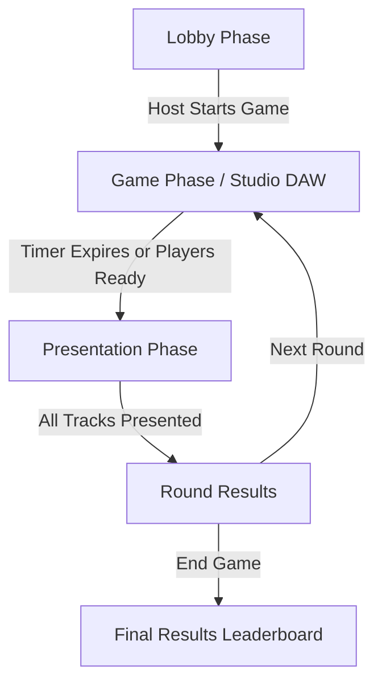

# MusicParty — Project Structure & Agent Architecture Guide

Welcome to **MusicParty**! This document provides a complete overview of the project's architecture, directory structure, data models, audio engine design, and coding guidelines for developers and Antigravity agents.

---

## 1. Project Overview

**MusicParty** is a real-time multiplayer collaborative music creation and party voting web game. Players join a lobby with custom avatars, receive a random musical genre challenge, create beat loops and record vocals in an in-browser digital audio workstation (DAW), and then listen and rate each other's tracks before a final winner is crowned.

### Core Game Loop


1. **Lobby (`lobby`)**: Character creation (DiceBear custom avatar & accessories), room creation/joining via 6-character code, player list management, and game configuration (time, max players, genre pool).
2. **Game Phase (`playing`)**: Real-time multi-track DAW with drag-and-drop sample sequencing, live microphone recording, and synchronized timer.
3. **Presentation Phase (`presenting`)**: Sequential playback of each player's creation with real-time synchronized 1–5 star voting by other players.
4. **Round Results (`round_results`)**: Aggregated round scores calculated from votes and added to the cumulative total.
5. **Final Results (`final_results`)**: Final celebratory podium ranking all players.

---

## 2. Tech Stack

- **Framework**: [React 19](https://react.dev/) + [Vite](https://vite.dev/) (ES Modules)
- **Real-Time Backend**: [Firebase Realtime Database](https://firebase.google.com/docs/database) (`firebase/database`)
- **Web Audio & Synthesis**: [Tone.js](https://tonejs.github.io/) (`tone`) + Web Audio API & `MediaRecorder`
- **Styling**: [Tailwind CSS v4](https://tailwindcss.com/) (`@tailwindcss/vite`), Fredoka typography, custom chunky/neobrutalist game UI classes
- **Avatars**: [DiceBear Core & Micah Collection](https://www.dicebear.com/styles/micah/) (`@dicebear/core`, `@dicebear/collection`) + custom overlay layers
- **Icons**: [React Icons](https://react-icons.github.io/react-icons/) (`react-icons/fa`)
- **Linting**: [Oxlint](https://oxc.rs/) (`.oxlintrc.json`)

---

## 3. Directory & File Structure

```
MusicParty/
├── .env                                # Local environment variables (SoundCloud API key)
├── .env.example                        # Example environment template
├── .git/                               # Git version control directory
├── .gitignore                          # Ignored files (node_modules, dist, etc.)
├── .oxlintrc.json                      # Oxlint rule configuration
├── AGY.md                              # Antigravity project structure & dev guide
├── README.md                           # Project readme
├── index.html                          # Single-page entry HTML
├── package.json                        # Dependencies, scripts, and metadata
├── package-lock.json                   # Locked dependency tree
├── vite.config.js                      # Vite build configuration (React & Tailwind plugins)
├── public/                             # Static assets
│   ├── favicon.svg                     # Browser favicon
│   └── icons.svg                       # SVG icons
└── src/                                # Application source code
    ├── App.css                         # Legacy / component styling
    ├── App.jsx                         # Root application & state router
    ├── firebase.js                     # Firebase initialization & configuration
    ├── index.css                       # Tailwind CSS imports & theme utilities
    ├── main.jsx                        # React root entry point
    ├── assets/                         # Graphic assets and logos
    │   ├── hero.png
    │   ├── react.svg
    │   └── vite.svg
    ├── services/                       # External API and helper services
    │   └── soundCloud.js               # SoundCloud API client, search, stream resolver & presets
    └── components/                     # React UI components
        ├── GamePhase.jsx               # Game phase manager (timer & DAW container)
        ├── Lobby.jsx                   # Lobby home & In-Room manager (atomic host assignment)
        ├── PresentationPhase.jsx       # Presentation playback & voting interface
        ├── RoundResults.jsx            # Round and final scoring podiums
        ├── StepSequencer.jsx           # 16-step modular sequencer
        ├── VoiceRecorder.jsx           # Standalone microphone recorder
        ├── game/                       # In-game subcomponents
        │   ├── SongCard.jsx            # Genre reveal card popup with SoundCloud audio preview
        │   └── workspace/              # Digital Audio Workstation (DAW)
        │       ├── AudioEngine.js      # Tone.js audio engine & track synchronizer
        │       └── MusicWorkspace.jsx  # Multi-track timeline, sample/SoundCloud browser, recording
        └── lobby/                      # Lobby subcomponents
            ├── AvatarViewer.jsx        # DiceBear renderer with accessory overlays
            ├── CharacterCreator.jsx    # Avatar & name customization UI
            ├── JoinCodeBox.jsx         # Shareable room code & clipboard invite link
            ├── LobbySettings.jsx       # Host controls (time, player limits, genres)
            └── PlayerList.jsx          # Room roster & host kick controls
```

---

## 4. Firebase Realtime Database Schema

All multiplayer state is synchronized under the root `/rooms/{roomId}` path:

```json
{
  "rooms": {
    "ROOM_ID": {
      "host": "player_abc123",
      "status": "lobby | playing | presenting | round_results | final_results",
      "startTime": 1726550000000,
      "gameDurationMs": 600000,
      "currentStyle": "Synthpop 80s",
      "settings": {
        "maxPlayers": 10,
        "timeMinutes": 10,
        "genres": ["Pop", "Hip-Hop", "EDM", "Lo-Fi", "Trap", "Synthpop 80s"]
      },
      "players": {
        "player_abc123": {
          "name": "Lil Fero",
          "score": 14.5,
          "avatarConfig": {
            "eyes": ["smiling"],
            "hair": ["mrT"],
            "shirt": ["crew"],
            "baseColor": ["ffcca5"],
            "shirtColor": ["9287ff"],
            "glasses": ["round"],
            "glassesProbability": 100,
            "adultEyes": "sleepy",
            "headwear": "headphones_dj",
            "shirtDecal": "gold_chain",
            "heldItem": "mic",
            "background": "studio"
          }
        }
      },
      "tracks": {
        "player_abc123": {
          "ready": true,
          "timestamp": 1726550500000,
          "sequence": [[false, true]],
          "voiceBase64": "data:audio/webm;base64,..."
        }
      },
      "presentQueue": ["player_abc123", "player_xyz789"],
      "currentPresenter": "player_abc123",
      "presentationStartTime": 1726550600000,
      "votes": {
        "player_abc123": {
          "player_xyz789": 5
        }
      }
    }
  }
}
```

---

## 5. Audio Architecture (`Tone.js`)

- **Audio Initialization**: Web Audio context is started on first user action (`Tone.start()`) to comply with browser autoplay policies.
- **Tone.Transport**: Manages global tempo (BPM) and timeline looping (default: 180 seconds loop maximum).
- **Tone.Part & Tone.Loop**: Used for scheduling clip playback events without drift.
- **Voice Recording**: Uses browser `navigator.mediaDevices.getUserMedia({ audio: true })` and `MediaRecorder`. Blob is converted to Base64 data URL for persistence and presentation.
- **Resource Cleanup**: Always call `.dispose()` on `Tone.Synth`, `Tone.Part`, and `Tone.Player` instances when components unmount to prevent audio node memory leaks.

---

## 6. UI & Design System

The application uses a **chunky retro neobrutalist** theme with heavy borders, hard shadows, vibrant accents, and the `Fredoka` font:

| Utility Class | Description |
| :--- | :--- |
| `.btn-chunky` | Base chunky button styling with active pushdown motion |
| `.btn-chunky-purple` | Purple call-to-action button with bottom shadow |
| `.btn-chunky-green` | Green confirmation / start button |
| `.btn-chunky-pink` | Pink accent action button |
| `.btn-chunky-gray` | Secondary neutral button |
| `.chunky-panel` | Dark card container with 4px black borders & 8px hard drop shadow |

---

## 7. Developer Scripts

| Command | Action |
| :--- | :--- |
| `npm run dev` | Starts Vite local development server |
| `npm run build` | Compiles and builds production-ready bundle into `dist/` |
| `npm run preview` | Runs a local web server to preview production build |
| `npm run lint` | Runs `oxlint` fast linter on the codebase |

---

## 8. Development Guidelines for Agents

1. **Firebase Operations**: Use granular Firebase paths (`ref(db, 'rooms/${roomId}/path')`) for updates rather than replacing entire room trees to avoid overwriting concurrent player data.
2. **Audio Nodes Lifecycle**: Never leave active audio intervals or un-disposed `Tone.js` loops running when changing views or unmounting components.
3. **Local State Persistence**: Use `localStorage` keys prefixed with `playerId` / `roomId` for work-in-progress DAW state recovery across page reloads.
4. **Code Quality**: Keep components modular, maintain React 19 hook rules, and verify linting with `npm run lint`.
