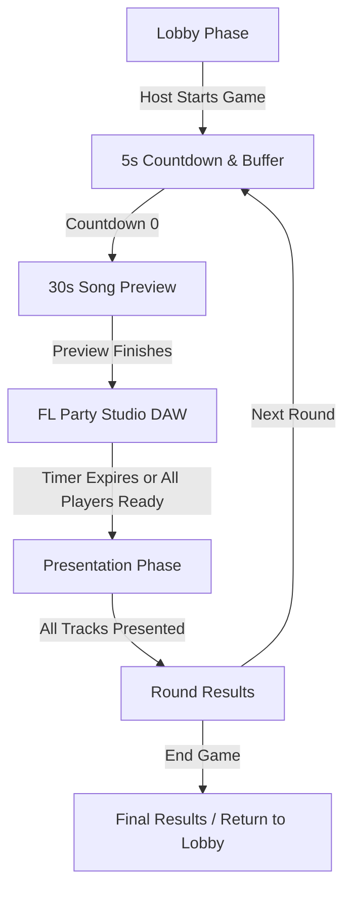

# MusicParty — Project Structure & Agent Architecture Guide

Welcome to **MusicParty**! This document provides a complete overview of the project's architecture, directory structure, data models, audio engine design, and coding guidelines for developers and Antigravity agents.

---

## 1. Project Overview

**MusicParty** is a real-time multiplayer collaborative music creation and party voting web game. Players join a room with custom avatars, listen to an inspirational 30-second world mega-hit based on a randomly selected genre, create their own beat, bassline, melodies, and vocals in a modern in-browser digital audio workstation (**FL Party Studio**), and then host-controlled presentations let everyone listen and rate each track before crowning a winner.

### Core Game Loop


1. **Lobby (`lobby`)**: Character creation (custom DiceBear avatar & accessories), room creation/joining via 6-character code, player list management, host controls (kick, disband, game time, genre selection), and persistent ambient lobby music.
2. **Countdown & Song Preview (`playing` start)**: 5-second countdown during which the YouTube audio buffers in the background, followed by a 30-second synchronized preview of a world-famous song in the selected genre with hook timestamps.
3. **Studio DAW Phase (`playing`) — FL Party Studio**:
   - **Pillar 1: Channel Rack / Step Sequencer**: 16-step grid with 4-beat color grouping, volume/pan sliders, mute/solo, instant genre templates (Trap, House, Boom-Bap, Lo-Fi, Reggaeton), and "Stamp to Arranger" button.
   - **Pillar 2: Piano Roll**: Visual 2-octave grid with Scale Lock (Minor Pentatonic, Major, Trap, Blues, etc.), note placing/duration, instrument sound presets (Pluck Synth, Electric Piano, Lead Synth, 808 Sub Bass, Retro Pad), and melody templates.
   - **Pillar 3: Playlist / Arranger**: 6-track arrangement timeline (Drums, Bass, Chords, Lead, FX, Vocals) with top ruler playhead scrubber, clip stamping/dragging, and vocal take recording with 3-2-1 countdown.
4. **Presentation Phase (`presenting`)**: Sequential host-controlled playback of each player's creation (Play/Pause/Replay/Next) with real-time synchronized 1–5 star voting by other players.
5. **Round Results (`round_results`)**: Aggregated round scores calculated from votes and added to cumulative player totals.
6. **Final Results (`final_results`)**: Final celebratory podium ranking all players, with host option to return everyone to the lobby.

---

## 2. Tech Stack

- **Framework**: [React 19](https://react.dev/) + [Vite](https://vite.dev/) (ES Modules)
- **Real-Time Backend**: [Firebase Realtime Database](https://firebase.google.com/docs/database) (`firebase/database`)
- **Web Audio & Synthesis**: [Tone.js](https://tonejs.github.io/) (`tone`) + Web Audio API & `MediaRecorder`
- **Video & Audio Streaming**: YouTube Data API v3 & YouTube IFrame API (`youtubeService.js`)
- **Styling**: [Tailwind CSS v4](https://tailwindcss.com/) (`@tailwindcss/vite`), Fredoka typography, custom chunky/neobrutalist game UI classes
- **Avatars**: [DiceBear Core & Micah Collection](https://www.dicebear.com/styles/micah/) (`@dicebear/core`, `@dicebear/collection`) + custom overlay accessories
- **Internationalization (i18n)**: Custom `LanguageContext` supporting English (EN), Slovak (SK), Spanish (ES), and German (DE)
- **Icons**: [React Icons](https://react-icons.github.io/react-icons/) (`react-icons/fa`)
- **Linting**: [Oxlint](https://oxc.rs/) (`.oxlintrc.json`)

---

## 3. Directory & File Structure

```
MusicParty/
├── .env                                # Local environment variables (VITE_YOUTUBE_API_KEY, Firebase credentials)
├── .env.example                        # Example environment template
├── .git/                               # Git version control directory
├── .gitignore                          # Ignored files (node_modules, dist, .env, etc.)
├── .oxlintrc.json                      # Oxlint rule configuration
├── AGY.md                              # Antigravity project structure & dev guide
├── README.md                           # Project readme
├── index.html                          # Single-page entry HTML
├── package.json                        # Dependencies, scripts, and metadata
├── package-lock.json                   # Locked dependency tree
├── vite.config.js                      # Vite build configuration (React & Tailwind plugins)
├── public/                             # Static assets
│   ├── favicon.svg                     # Browser favicon
│   ├── icons.svg                       # SVG icons
│   └── lobby_song/                     # Persistent lobby ambient audio
└── src/                                # Application source code
    ├── App.css                         # Legacy / component styling
    ├── App.jsx                         # Root application, Firebase listener & state router
    ├── firebase.js                     # Firebase initialization & configuration
    ├── index.css                       # Tailwind CSS imports & theme utilities
    ├── main.jsx                        # React root entry point
    ├── assets/                         # Graphic assets and logos
    │   ├── hero.png
    │   ├── react.svg
    │   └── vite.svg
    ├── context/                        # React Context providers
    │   ├── LanguageContext.jsx         # Multi-language translation & locale provider (EN, SK, ES, DE)
    │   └── ThemeContext.jsx            # Dark / light theme management
    ├── services/                       # External API and helper services
    │   └── youtubeService.js           # YouTube Data API client & curated genre mega-hits with timestamps
    └── components/                     # React UI components
        ├── GamePhase.jsx               # Game phase manager (timer, countdown & DAW container)
        ├── Lobby.jsx                   # Lobby home & In-Room manager (atomic host assignment & leave/disband)
        ├── PresentationPhase.jsx       # Host-controlled presentation playback & live star voting
        ├── RoundResults.jsx            # Round and final scoring podiums
        ├── StepSequencer.jsx           # Legacy 16-step modular sequencer
        ├── VoiceRecorder.jsx           # Standalone microphone recorder
        ├── common/                     # Shared UI components
        │   ├── LanguageDropdown.jsx    # Flag & language picker dropdown
        │   ├── LanguageSwitcher.jsx    # Inline language switcher
        │   ├── LobbyAmbientMusic.jsx   # Ambient lobby background music controller
        │   ├── Navbar.jsx              # Header navbar with language and theme controls
        │   └── ThemeSwitcher.jsx       # Theme toggle button
        ├── game/                       # In-game subcomponents
        │   ├── CountdownOverlay.jsx    # 5-second countdown with background video pre-buffering
        │   ├── SongCard.jsx            # Genre reveal card popup with audio preview
        │   ├── SongPreviewOverlay.jsx  # 30-second inspirational YouTube music preview
        │   └── workspace/              # Digital Audio Workstation (FL Party Studio)
        │       ├── AudioEngine.js      # Tone.js audio engine, synths & multi-track synchronizer
        │       ├── MusicWorkspace.jsx  # Master DAW shell & transport manager
        │       ├── StepSequencerTab.jsx# Channel Rack / 16-step beat maker & genre templates
        │       ├── PianoRollTab.jsx    # 2-octave Piano Roll with Scale Lock & melodic instruments
        │       ├── PlaylistArrangerTab.jsx # 6-track 30s timeline arrangement & vocal recording
        │       ├── SampleBrowserSidebar.jsx# Categorized sound preset library & quick add
        │       ├── presetData.js       # Beat presets, melodic instruments & chord progressions
        │       └── scaleUtils.js       # Scale lock definitions (Pentatonic, Minor, Trap, Blues)
        └── lobby/                      # Lobby subcomponents
            ├── AvatarPartsSvg.jsx      # Custom SVG accessories & overlays
            ├── AvatarViewer.jsx        # DiceBear renderer with accessory overlays
            ├── CharacterCreator.jsx    # Avatar & name customization UI
            ├── JoinCodeBox.jsx         # Shareable room code & clipboard invite link
            ├── LobbySettings.jsx       # Host controls (time, player limits, genres)
            ├── PlayerList.jsx          # Room roster & host kick / leave controls
            └── avatarData.js           # Accessory categories & color palettes
```

---

## 4. Firebase Realtime Database Schema

All multiplayer state is synchronized under the root `/rooms/{roomId}` path:

```json
{
  "rooms": {
    "ROOM_ID": {
      "host": "player_abc123",
      "status": "lobby | playing | presenting | round_results | final_results",
      "startTime": 1726550000000,
      "gameDurationMs": 600000,
      "currentStyle": "Synthpop 80s",
      "currentSong": {
        "videoId": "4NRXx6U8ABQ",
        "title": "Blinding Lights",
        "artist": "The Weeknd",
        "startTime": 25,
        "thumbnail": "https://img.youtube.com/vi/4NRXx6U8ABQ/hqdefault.jpg"
      },
      "settings": {
        "maxPlayers": 10,
        "timeMinutes": 10,
        "genres": ["Pop", "Hip-Hop", "Rock", "EDM", "Lo-Fi", "Trap", "Synthpop 80s"]
      },
      "players": {
        "player_abc123": {
          "name": "Lil Fero",
          "score": 14.5,
          "avatarConfig": {
            "eyes": ["smiling"],
            "hair": ["mrT"],
            "shirt": ["crew"],
            "baseColor": ["ffcca5"],
            "shirtColor": ["9287ff"],
            "glasses": ["round"],
            "glassesProbability": 100,
            "headwear": "headphones_dj",
            "shirtDecal": "gold_chain",
            "heldItem": "mic",
            "background": "studio"
          }
        }
      },
      "tracks": {
        "player_abc123": {
          "ready": true,
          "timestamp": 1726550500000,
          "tracks": [
            {
              "id": "t1",
              "name": "🥁 Beat (Drums)",
              "type": "audio",
              "volume": 100,
              "muted": false,
              "clips": [
                {
                  "id": "clip_123",
                  "name": "Drums (Pattern 1)",
                  "color": "bg-red-500",
                  "startAt": 0,
                  "duration": 4,
                  "patternData": { ... }
                }
              ]
            },
            {
              "id": "t2",
              "name": "🔊 808 Bass",
              "type": "audio",
              "volume": 100,
              "muted": false,
              "clips": [
                {
                  "id": "clip_456",
                  "name": "808 Bassline",
                  "instrument": "bass",
                  "color": "bg-blue-500",
                  "startAt": 0,
                  "duration": 4,
                  "notes": [ ... ]
                }
              ]
            }
          ]
        }
      },
      "presentQueue": ["player_abc123", "player_xyz789"],
      "currentPresenter": "player_abc123",
      "presentationPlaying": false,
      "presentationPlayStartTime": 1726550600000,
      "presentationStartTime": 1726550600000,
      "votes": {
        "player_abc123": {
          "player_xyz789": 5
        }
      }
    }
  }
}
```

---

## 5. Audio & Studio Architecture (`Tone.js`)

- **Tone.js Sound Synthesis**:
  - Drum Synths: `Tone.MembraneSynth` (Kick, Punchy Kick), `Tone.NoiseSynth` (Snare, Clap, Closed Hat), `Tone.MetalSynth` (Open Hat, Perc, Vinyl Scratch, Crash), `Tone.MonoSynth` (808 Sub).
  - Melodic Instruments: `Tone.PolySynth` Pluck Synth, Electric Piano / Keys (`Tone.FMSynth`), Lead Synth, 808 Bass, Retro Synthwave Pad (`Tone.AMSynth`).
  - Master Chain: Volume Node with Tone Analyser for live visualizer EQ bars.
- **Accurate Clip Durations & Pattern Stamping**:
  - Drum patterns from Channel Rack stamp as 4-second blocks onto Track 1.
  - Melodies and chord progressions from Piano Roll stamp as 4-second blocks onto Tracks 2 & 3.
  - One-shot samples and custom recorded vocal takes fit their exact duration.
- **Live Microphone Recording**: 3-2-1 countdown flow, exact duration calculation, Base64 WebM audio blob encoding.
- **Timeline Pointer Movement**: Restricted strictly to the top timeline ruler bar, aligned 1:1 with track dropzones.
- **Studio State Lifecycle**: In-memory state only (no localStorage caching), ensuring every new round starts clean.
- **Synchronized Presentation Playback**: Host commands trigger global audio playback synchronized across all listeners via Firebase `presentationPlaying` and `presentationPlayStartTime`.

---

## 6. UI & Design System

The application uses a **chunky retro neobrutalist** theme with heavy borders, hard drop shadows, vibrant accents, and the `Fredoka` font:

| Utility Class | Description |
| :--- | :--- |
| `.btn-chunky` | Base chunky button styling with active pushdown motion |
| `.btn-chunky-purple` | Purple call-to-action button with bottom shadow |
| `.btn-chunky-green` | Green confirmation / start button |
| `.btn-chunky-pink` | Pink accent action button |
| `.btn-chunky-gray` | Secondary neutral button |
| `.chunky-panel` | Dark card container with 4px black borders & 8px hard drop shadow |

---

## 7. Developer Scripts

| Command | Action |
| :--- | :--- |
| `npm run dev` | Starts Vite local development server |
| `npm run build` | Compiles and builds production-ready bundle into `dist/` |
| `npm run preview` | Runs a local web server to preview production build |
| `npm run lint` | Runs `oxlint` fast linter on the codebase |

---

## 8. Development Guidelines for Agents

1. **Firebase Operations**: Use granular Firebase paths (`ref(db, 'rooms/${roomId}/path')`) for updates rather than replacing entire room trees to avoid overwriting concurrent player data.
2. **Audio Nodes Lifecycle**: Never leave active audio intervals or un-disposed `Tone.js` parts running when changing views or unmounting components.
3. **Web Audio Gesture Compliance**: Initialize `Tone.start()` on user interactions (clicks) to adhere to browser autoplay policies.
4. **DAW Interaction Separation**: Keep playhead scrubbing strictly isolated to the timeline ruler bar so track lanes remain dedicated to clip placement and sound arrangement.
5. **Localization (i18n)**: Always add new UI strings to all 4 supported languages (`EN`, `SK`, `ES`, `DE`) in [`LanguageContext.jsx`](file:///C:/Github%20repos/Fun/MusicParty/src/context/LanguageContext.jsx).
6. **Code Quality**: Keep components modular, maintain React 19 hook rules, and verify linting with `npm run lint` / `npm run build`.
